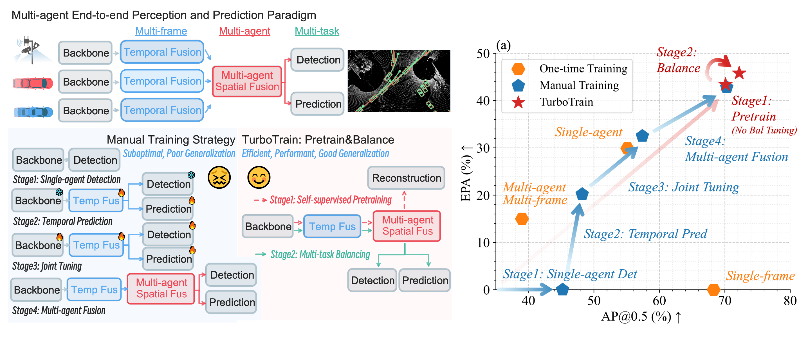

# TurboTrain: Towards Efficient and Balanced Multi-Task Learning for Multi-Agent Perception and Prediction

[](https://arxiv.org/pdf/2508.04682)
[](https://arxiv.org/pdf/2508.04682)

[ICCV 2025] This is the official implementation of "TurboTrain: Towards Efficient and Balanced Multi-Task Learning for Multi-Agent Perception and Prediction", [Zewei Zhou*](https://zewei-zhou.github.io/), [Seth Z. Zhao*](https://sethzhao506.github.io/), [Tianhui Cai](https://www.tianhui-vicky.com/), [Zhiyu Huang](https://mczhi.github.io/), [Bolei Zhou](https://boleizhou.github.io/), [Jiaqi Ma](https://mobility-lab.seas.ucla.edu/about/)



TurboTrain is the first efficient and balanced multi-task learning paradigm, comprising task-agnostic self-supervised pretraining and multi-task balancing, which eliminates the need for manually designing and tuning complex multi-stage training pipelines, reducing training time, and improving performance.

## News
- **`2025/08`**: [TurboTrain](https://arxiv.org/pdf/2508.04682) paper release
- **`2025/06`**: [TurboTrain](https://arxiv.org/pdf/2508.04682) is accepted by [ICCV 2025](https://iccv.thecvf.com/)!

## Release Plan
- **`2025/08`**: ✅ [TurboTrain](https://arxiv.org/pdf/2508.04682) paper
- **`2025/10`**: Full Codebase Release.

## Acknowledgement
The codebase is built upon [V2XPnP](https://github.com/Zewei-Zhou/V2XPnP) in the OpenCDA ecosystem family.


## Citation
If you find this repository useful for your research, please consider giving us a star 🌟 and citing our paper.
 ```bibtex
@article{zhou2025turbotraine,
  title={TurboTrain: Towards Efficient and Balanced Multi-Task Learning for Multi-Agent Perception and Prediction},
  author={Zhou, Zewei and Zhao, Seth Z. and Cai, Tianhui and Huang, Zhiyu and Zhou, Bolei and Ma, Jiaqi},
  journal={arXiv preprint arXiv:2508.04682},
  year={2025}
}
```